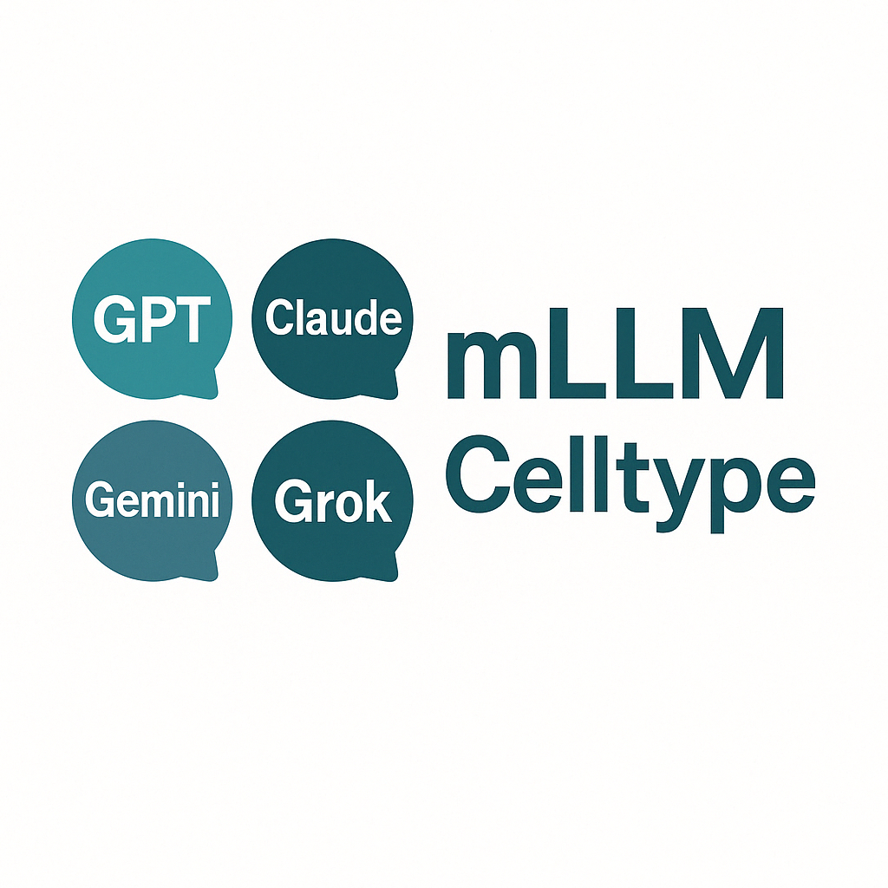

<div align="center">

# mLLMCelltype



<p><strong>Multi-LLM Consensus Framework for Cell Type Annotation in scRNA-seq Data</strong></p>

<p>
  <a href="https://github.com/cafferychen777/mLLMCelltype/stargazers"></a>
  <a href="https://github.com/cafferychen777/mLLMCelltype/network/members"></a>
  <a href="https://discord.gg/pb2aZdG4"></a>
</p>

<p>
  
  
  
  
  <a href="https://doi.org/10.1038/s42003-026-10420-8"></a>
</p>

</div>

## Multi-LLM Consensus Architecture for Cell Type Annotation in scRNA-seq Data

mLLMCelltype is an R package that leverages various large language models (LLMs) for automated cell type annotation in single-cell RNA sequencing data. The package implements a **multi-LLM consensus architecture** where multiple LLMs collaborate through structured deliberation that aims to improve annotation reliability by combining multiple model predictions.

### Key Features

* **Multi-LLM Consensus Mechanism**: Combines predictions from multiple LLMs to reduce individual model biases
* **Structured Deliberation Process**: For controversial clusters, LLMs engage in collaborative discussion across multiple rounds, evaluating evidence and refining annotations together
* **Uncertainty Quantification**: Explicitly quantifies annotation uncertainty through consensus proportion and Shannon entropy
* **No Reference Dataset Required**: Does not rely on pre-existing reference datasets, can annotate various tissues and species
* **Support for Multiple LLM Providers**:
  - OpenAI (GPT-5.5, GPT-5.4, GPT-5.4-mini)
  - Anthropic (Claude Opus 4.7, Claude Sonnet 4.6, Claude Haiku 4.5)
  - Google (Gemini 3.1 Pro Preview, Gemini 3 Flash Preview, Gemini 3.1 Flash-Lite)
  - X.AI (Grok 4.3)
  - DeepSeek (DeepSeek V4 Flash, DeepSeek V4 Pro)
  - Qwen (Qwen3.6 Plus, Qwen3.6 Flash, Qwen3.6 Max Preview)
  - Zhipu/Z.AI (GLM-5.1, GLM-5, GLM-5-Turbo)
  - MiniMax (MiniMax M2.7, MiniMax M2.7-highspeed)
  - Stepfun (Step 3.5 Flash, Step 3)
  - OpenRouter (access to Meta Llama, Mistral, Microsoft, Perplexity, Cohere, and more)
* **Seurat Integration**: Can directly use Seurat's FindAllMarkers() output as input

### Quick Start

```r
# Install the package
devtools::install_github("cafferychen777/mLLMCelltype", subdir = "R")

# Load the package
library(mLLMCelltype)

# Set API keys
Sys.setenv(ANTHROPIC_API_KEY = "your-anthropic-api-key")
Sys.setenv(OPENAI_API_KEY = "your-openai-api-key")
Sys.setenv(GEMINI_API_KEY = "your-gemini-api-key")

# Use multiple models for annotation
models <- c(
  "claude-sonnet-4-6",
  "gpt-5.5",
  "gemini-3.1-pro-preview"
)

# Run multi-model annotation
results <- list()
for (model in models) {
  provider <- get_provider(model)
  api_key <- switch(provider,
                   "anthropic" = Sys.getenv("ANTHROPIC_API_KEY"),
                   "openai" = Sys.getenv("OPENAI_API_KEY"),
                   "gemini" = Sys.getenv("GEMINI_API_KEY"))

  results[[model]] <- annotate_cell_types(
    input = pbmc_markers,
    tissue_name = "human PBMC",
    model = model,
    api_key = api_key
  )
}

# Create consensus using interactive consensus annotation
api_keys <- list(
  anthropic = Sys.getenv("ANTHROPIC_API_KEY"),
  openai = Sys.getenv("OPENAI_API_KEY"),
  gemini = Sys.getenv("GEMINI_API_KEY")
)

consensus_results <- interactive_consensus_annotation(
  input = pbmc_markers,
  tissue_name = "human PBMC",
  models = models,  # Use the models defined above
  api_keys = api_keys,
  controversy_threshold = 0.7,
  entropy_threshold = 1.0,
  max_discussion_rounds = 3,
  consensus_check_model = "claude-sonnet-4-6"
)

```

### Visualization


### Citation

If you use mLLMCelltype in your research, please cite our paper:

```bibtex
@article{yang2026llmconsensus,
  author = {Yang, Chen and Zhang, Xianyang and Chen, Jun},
  title = {Large language model consensus substantially improves the cell type annotation accuracy for scRNA-seq data},
  journal = {Communications Biology},
  year = {2026},
  volume = {9},
  pages = {779},
  doi = {10.1038/s42003-026-10420-8},
  publisher = {Nature Publishing Group}
}
```

You can also cite this in plain text format:

Yang, C., Zhang, X., & Chen, J. (2026). Large language model consensus substantially improves the cell type annotation accuracy for scRNA-seq data. *Communications Biology*, 9, 779. https://doi.org/10.1038/s42003-026-10420-8

### Learn More

Please check our [documentation](articles/01-introduction.html) to learn more about mLLMCelltype.
