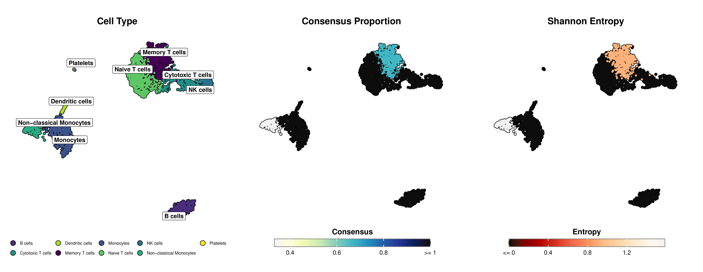

<div align="center">
  
</div>

<div align="center">
  <a href="README.md">English</a> | <a href="README_CN.md">中文</a> | <a href="README_JP.md">日本語</a> | <a href="README_DE.md">Deutsch</a> | <a href="README_FR.md">Français</a> | <a href="README_KR.md">한국어</a>
</div>

<div align="center">
  <a href="https://twitter.com/intent/tweet?text=Descubre%20mLLMCelltype%3A%20Un%20marco%20de%20consenso%20multi-LLM%20para%20la%20anotaci%C3%B3n%20de%20tipos%20celulares%20en%20datos%20scRNA-seq%21&url=https%3A%2F%2Fgithub.com%2Fcafferychen777%2FmLLMCelltype"></a>
  <a href="https://github.com/cafferychen777/mLLMCelltype/stargazers"></a>
  <a href="https://github.com/cafferychen777/mLLMCelltype/network/members"></a>
  <a href="https://discord.gg/pb2aZdG4"></a>
</div>

<div align="center">
  <a href="https://CRAN.R-project.org/package=mLLMCelltype"></a>
  <a href="https://CRAN.R-project.org/package=mLLMCelltype"></a>
  
  
  
  
  <a href="https://www.biorxiv.org/content/10.1101/2025.04.10.647852v1"></a>
  <a href="https://www.mllmcelltype.com/"></a>
  <a href="https://colab.research.google.com/github/cafferychen777/mLLMCelltype/blob/main/notebooks/mLLMCelltype_Tutorial.ipynb"></a>
</div>

# mLLMCelltype: Marco de Consenso Multi-Modelos de Lenguaje para la Anotación de Tipos Celulares

mLLMCelltype es un marco avanzado de consenso iterativo multi-LLM para la anotación precisa y confiable de tipos celulares en datos de secuenciación de ARN unicelular (scRNA-seq). Al aprovechar la inteligencia colectiva de múltiples modelos de lenguaje grande (OpenAI GPT-5/4.1, Anthropic Claude-4/3.7/3.5, Google Gemini-2.0, X.AI Grok-3, DeepSeek-V3, Alibaba Qwen2.5, Zhipu GLM-4, MiniMax, Stepfun, y OpenRouter), este marco mejora significativamente la precisión de anotación mientras proporciona una cuantificación transparente de la incertidumbre para la investigación en bioinformática y biología computacional.

## Resumen

mLLMCelltype es una herramienta de código abierto para el análisis transcriptómico unicelular que utiliza múltiples modelos de lenguaje grande para identificar tipos celulares a partir de datos de expresión génica. El software implementa un enfoque de consenso donde varios modelos analizan los mismos datos y sus predicciones se combinan, lo que ayuda a reducir errores y proporciona métricas de incertidumbre. mLLMCelltype se integra con plataformas populares de análisis unicelular como Scanpy y Seurat, permitiendo a los investigadores incorporarlo a flujos de trabajo bioinformáticos existentes. A diferencia de algunos métodos tradicionales, no requiere conjuntos de datos de referencia para la anotación.

## Tabla de Contenidos
- [Noticias](#noticias)
- [Características Principales](#características-principales)
- [Actualizaciones Recientes](#actualizaciones-recientes)
- [Estructura del Directorio](#estructura-del-directorio)
- [Instalación](#instalación)
- [Ejemplos de Uso](#ejemplos-de-uso)
- [Ejemplo de Visualización](#ejemplo-de-visualización)
- [Citación](#citación)
- [Contribuciones](#contribuciones)

## Noticias

🚀 **Lanzamiento de la Aplicación Web (18-06-2025)**

¡Nos complace anunciar el lanzamiento de la Aplicación Web de mLLMCelltype! Ahora puede acceder a las potentes capacidades de anotación de tipos celulares de mLLMCelltype directamente a través de su navegador web sin necesidad de instalación.

**✨ Características Principales:**
- **Interfaz fácil de usar**: Cargue sus datos de scRNA-seq y obtenga anotaciones en minutos
- **Consenso multi-LLM**: Elija entre varios modelos de IA incluyendo GPT-4, Claude, Gemini y más
- **Procesamiento en tiempo real**: Monitoree el progreso de la anotación con actualizaciones en vivo
- **Múltiples formatos de exportación**: Descargue resultados en formatos CSV, TSV, Excel o JSON
- **Sin configuración requerida**: Comience a anotar inmediatamente sin instalar paquetes

**🌐 Acceda a la Aplicación Web**: [https://mllmcelltype.com](https://mllmcelltype.com)

**⚠️ Fase de Prueba Beta**: La aplicación web se encuentra actualmente en fase de prueba beta. Agradecemos sus comentarios y sugerencias para ayudarnos a mejorar la plataforma. Por favor, informe cualquier problema o comparta su experiencia a través de nuestras [GitHub Issues](https://github.com/cafferychen777/mLLMCelltype/issues) o [comunidad Discord](https://discord.gg/pb2aZdG4).

**📢 Importante: Migración de Modelos Gemini (02-06-2025)**

Google ha descontinuado varios modelos Gemini 1.5 y descontinuará más el 24 de septiembre de 2025:
- **Ya descontinuados**: Gemini 1.5 Pro 001, Gemini 1.5 Flash 001
- **Se descontinuarán el 24 de sept. de 2025**: Gemini 1.5 Pro 002, Gemini 1.5 Flash 002, Gemini 1.5 Flash-8B -001

**Migración recomendada**: Use `gemini-2.5-pro` o `gemini-2.5-flash` para un mejor rendimiento y capacidades de razonamiento mejoradas. Los alias `gemini-1.5-pro` y `gemini-1.5-flash` seguirán funcionando hasta el 24 de septiembre de 2025, ya que apuntan a las versiones -002.

**📢 Importante: Desactivación de Modelos Claude (21-07-2025)**

Anthropic descontinuará varios modelos Claude el 21 de julio de 2025:
- **Modelos a descontinuar**: Claude 2, Claude 2.1, Claude 3 Sonnet (sin versión), Claude 3 Opus (sin versión)

**Migración recomendada**:
- Claude 2/2.1 → `claude-sonnet-4-5-20250929` o `claude-3-5-sonnet-20241022`
- Claude 3 Sonnet → `claude-sonnet-4-5-20250929` o `claude-3-7-sonnet-20250219`
- Claude 3 Opus → `claude-sonnet-4-5-20250929` o `claude-3-opus-20240229`

Por favor, actualice sus modelos antes del 21 de julio de 2025 para evitar interrupciones del servicio.

🎉 **Abril 2025**: ¡Estamos encantados de anunciar que, en solo dos semanas desde la publicación de nuestro preprint, mLLMCelltype ha superado las 200 estrellas en GitHub! También hemos visto una gran cobertura por parte de varios medios de comunicación y creadores de contenido. Extendemos nuestro más sincero agradecimiento a todos los que han apoyado este proyecto a través de estrellas, compartiendo y contribuciones. Su entusiasmo impulsa nuestro continuo desarrollo y mejora de mLLMCelltype.

## Características Principales

- **Arquitectura de Consenso Multi-LLM**: Aprovecha la inteligencia colectiva de diversos LLMs para superar las limitaciones y sesgos de modelos individuales
- **Proceso de Deliberación Estructurado**: Permite a los LLMs compartir razonamientos, evaluar evidencias y refinar anotaciones a través de múltiples rondas de discusión colaborativa
- **Cuantificación Transparente de Incertidumbre**: Proporciona métricas cuantitativas (Proporción de Consenso y Entropía de Shannon) para identificar poblaciones celulares ambiguas que requieren revisión por expertos
- **Reducción de Alucinaciones**: La deliberación entre modelos suprime activamente predicciones inexactas o sin respaldo mediante evaluación crítica
- **Robustez ante Ruido de Entrada**: Mantiene alta precisión incluso con listas de genes marcadores imperfectas mediante corrección colectiva de errores
- **Soporte para Anotación Jerárquica**: Extensión opcional para análisis multi-resolución con consistencia padre-hijo
- **No Requiere Conjunto de Datos de Referencia**: Realiza anotaciones precisas sin entrenamiento previo o datos de referencia
- **Cadenas de Razonamiento Completas**: Documenta el proceso completo de deliberación para una toma de decisiones transparente
- **Integración Perfecta**: Funciona directamente con flujos de trabajo estándar de Scanpy/Seurat y salidas de genes marcadores
- **Diseño Modular**: Incorpora fácilmente nuevos LLMs a medida que estén disponibles

## Actualizaciones Recientes

### v1.2.3 (10-05-2025)

#### Corrección de Errores
- Se corrigió el manejo de errores en la verificación de consenso cuando las respuestas de API son NULL o inválidas
- Se mejoró el registro de errores para las respuestas de error de la API de OpenRouter
- Se agregó una verificación robusta de NULL y tipo en la función check_consensus

#### Mejoras
- Diagnóstico de errores mejorado para errores de API de OpenRouter
- Se agregó el registro detallado de mensajes de error de API y estructuras de respuesta
- Se mejoró la robustez al manejar formatos de respuesta de API inesperados

### v1.2.2 (09-05-2025)

#### Corrección de Errores
- Se corrigió el error 'argumento no carácter' que ocurría al procesar respuestas de API
- Se agregó verificación robusta de tipos para respuestas de API en todos los proveedores de modelos
- Se mejoró el manejo de errores para formatos de respuesta de API inesperados

#### Mejoras
- Se agregó registro detallado de errores para problemas de respuesta de API
- Se implementaron patrones consistentes de manejo de errores en todas las funciones de procesamiento de API
- Se mejoró la validación de respuestas para garantizar la estructura adecuada antes del procesamiento

### v1.2.1 (01-05-2025)

#### Mejoras
- Se agregó soporte para la API de OpenRouter
- Se agregó soporte para modelos gratuitos a través de OpenRouter
- Se actualizó la documentación con ejemplos para usar modelos de OpenRouter

### v1.2.0 (30-04-2025)

#### Características
- Se agregaron funciones de visualización para resultados de anotación de tipos celulares
- Se agregó soporte para visualización de métricas de incertidumbre
- Se implementó un algoritmo mejorado de construcción de consenso

### v1.1.5 (27-04-2025)

#### Corrección de Errores
- Se corrigió un problema con la validación de índices de clúster que causaba errores al procesar ciertos archivos de entrada CSV
- Se mejoró el manejo de errores para índices negativos con mensajes de error más claros

#### Mejoras
- Se agregó un script de ejemplo para el flujo de trabajo de anotación basado en CSV (cat_heart_annotation.R)
- Se mejoró la validación de entrada con diagnósticos más detallados
- Se actualizó la documentación para aclarar los requisitos de formato de entrada CSV

Consulte [NEWS.md](R/NEWS.md) para un registro completo de cambios.

## Estructura de Directorios

- `R/`: Interfaz e implementación en lenguaje R
- `python/`: Interfaz e implementación en Python

## Instalación

### Versión R

```r
# Instalar desde CRAN (recomendado)
install.packages("mLLMCelltype")

# O instalar la versión de desarrollo desde GitHub
devtools::install_github("cafferychen777/mLLMCelltype", subdir = "R")
```

### Versión Python

[](https://colab.research.google.com/drive/1ZgmtlaORogSy0-QsaF0CHwFWOyOD26d2?usp=sharing)

**Inicio Rápido**: ¡Pruebe mLLMCelltype al instante en Google Colab sin necesidad de instalación! Haga clic en el botón de arriba para abrir nuestro cuaderno interactivo con ejemplos y guía paso a paso.

```bash
# Instalar desde PyPI
pip install mllmcelltype

# O instalar desde GitHub (note el parámetro subdirectory)
pip install git+https://github.com/cafferychen777/mLLMCelltype.git#subdirectory=python
```

#### Nota Importante sobre Dependencias

mLLMCelltype utiliza un diseño modular donde las diferentes bibliotecas de proveedores de LLM son dependencias opcionales. Dependiendo de qué modelos planea usar, necesitará instalar los paquetes correspondientes:

```bash
# Para usar modelos de OpenAI (GPT-5, etc.)
pip install "mllmcelltype[openai]"

# Para usar modelos de Anthropic (Claude)
pip install "mllmcelltype[anthropic]"

# Para usar modelos de Google (Gemini)
pip install "mllmcelltype[gemini]"

# Para instalar todas las dependencias opcionales de una vez
pip install "mllmcelltype[all]"
```

Si encuentra errores como `ImportError: cannot import name 'genai' from 'google'`, significa que necesita instalar el paquete del proveedor correspondiente. Por ejemplo:

```bash
# Para modelos Google Gemini
pip install google-genai
```

### Modelos Soportados

- **OpenAI**: GPT-4.1/GPT-4.5/GPT-5 ([Clave API](https://platform.openai.com/settings/organization/billing/overview))
- **Anthropic**: Claude-3.7-Sonnet/Claude-3.5-Haiku ([Clave API](https://console.anthropic.com/))
- **Google**: Gemini-2.5-Pro/Gemini-2.5-Flash ([Clave API](https://ai.google.dev/?authuser=2))
- **Alibaba**: Qwen2.5-Max ([Clave API](https://www.alibabacloud.com/en/product/modelstudio))
- **DeepSeek**: DeepSeek-V3/DeepSeek-R1 ([Clave API](https://platform.deepseek.com/usage))
- **Minimax**: MiniMax-Text-01 ([Clave API](https://intl.minimaxi.com/user-center/basic-information/interface-key))
- **Stepfun**: Step-2-16K ([Clave API](https://platform.stepfun.com/account-info))
- **Zhipu**: GLM-4 ([Clave API](https://bigmodel.cn/))
- **X.AI**: Grok-3/Grok-3-mini ([Clave API](https://accounts.x.ai/))
- **OpenRouter**: Acceso a múltiples modelos a través de una sola API ([Clave API](https://openrouter.ai/keys))
  - Compatible con modelos de OpenAI, Anthropic, Meta, Google, Mistral y más
  - Formato: 'proveedor/nombre-modelo' (por ejemplo, 'openai/gpt-5', 'anthropic/claude-opus-4.1')
  - Modelos gratuitos disponibles con el sufijo `:free` (por ejemplo, 'deepseek/deepseek-r1:free', 'deepseek/deepseek-chat:free')

## Ejemplos de Uso

### Python

```python
# Ejemplo de uso de mLLMCelltype para anotación de tipos celulares en datos scRNA-seq con Scanpy
import scanpy as sc
import pandas as pd
from mllmcelltype import annotate_clusters, interactive_consensus_annotation
import os

# Nota: El registro se configura automáticamente al importar mllmcelltype
# Puede personalizar el registro si es necesario usando el módulo logging

# Cargar su conjunto de datos de scRNA-seq en formato AnnData
adata = sc.read_h5ad('your_data.h5ad')  # Reemplace con la ruta de su conjunto de datos scRNA-seq

# Realizar clustering de Leiden para identificación de poblaciones celulares si aún no se ha hecho
if 'leiden' not in adata.obs.columns:
    print("Calculando clustering de leiden para identificación de poblaciones celulares...")
    # Preprocesar datos unicelulares: normalizar conteos y log-transformar para análisis de expresión génica
    if 'log1p' not in adata.uns:
        sc.pp.normalize_total(adata, target_sum=1e4)  # Normalizar a 10,000 conteos por célula
        sc.pp.log1p(adata)  # Log-transformar conteos normalizados

    # Reducción de dimensionalidad: calcular PCA para datos scRNA-seq
    if 'X_pca' not in adata.obsm:
        sc.pp.highly_variable_genes(adata, min_mean=0.0125, max_mean=3, min_disp=0.5)  # Seleccionar genes informativos
        sc.pp.pca(adata, use_highly_variable=True)  # Calcular componentes principales

    # Clustering celular: calcular grafo de vecindad y realizar detección de comunidades Leiden
    sc.pp.neighbors(adata, n_neighbors=10, n_pcs=30)  # Construir grafo KNN para clustering
    sc.tl.leiden(adata, resolution=0.8)  # Identificar poblaciones celulares usando algoritmo Leiden
    print(f"Clustering Leiden completado, se identificaron {len(adata.obs['leiden'].cat.categories)} poblaciones celulares distintas")

# Identificar genes marcadores para cada cluster celular usando análisis de expresión diferencial
sc.tl.rank_genes_groups(adata, 'leiden', method='wilcoxon')  # Prueba de suma de rangos de Wilcoxon para detección de marcadores

# Extraer genes marcadores principales para cada cluster celular para usar en anotación de tipos celulares
marker_genes = {}
for i in range(len(adata.obs['leiden'].cat.categories)):
    # Seleccionar los 10 genes diferencialmente expresados principales como marcadores para cada cluster
    genes = [adata.uns['rank_genes_groups']['names'][str(i)][j] for j in range(10)]
    marker_genes[str(i)] = genes

# IMPORTANTE: mLLMCelltype requiere símbolos de genes (ej. KCNJ8, PDGFRA) no IDs de Ensembl (ej. ENSG00000176771)
# Si su objeto AnnData usa IDs de Ensembl, conviértalos a símbolos de genes para anotación precisa:
# Código de conversión de ejemplo:
# if 'Gene' in adata.var.columns:  # Verificar si los símbolos de genes están disponibles en los metadatos
#     gene_name_dict = dict(zip(adata.var_names, adata.var['Gene']))
#     marker_genes = {cluster: [gene_name_dict.get(gene_id, gene_id) for gene_id in genes]
#                    for cluster, genes in marker_genes.items()}

# IMPORTANTE: mLLMCelltype requiere IDs de cluster numéricos
# La columna 'cluster' debe contener valores numéricos o valores que se puedan convertir a numéricos.
# IDs de cluster no numéricos (ej. "cluster_1", "T_cells", "7_0") pueden causar errores o comportamiento inesperado.
# Si sus datos contienen IDs de cluster no numéricos, cree un mapeo entre IDs originales e IDs numéricos:
# Código de estandarización de ejemplo:
# original_ids = list(marker_genes.keys())
# id_mapping = {original: idx for idx, original in enumerate(original_ids)}
# marker_genes = {str(id_mapping[cluster]): genes for cluster, genes in marker_genes.items()}

# Configurar claves API para los modelos de lenguaje grande usados en anotación de consenso
# Se requiere al menos una clave API para anotación de consenso multi-LLM
os.environ["OPENAI_API_KEY"] = "your-openai-api-key"      # Para modelos GPT-5/4.1 (recomendado)
os.environ["ANTHROPIC_API_KEY"] = "your-anthropic-api-key"  # Para modelos Claude-3.7/3.5
os.environ["GEMINI_API_KEY"] = "your-gemini-api-key"      # Para modelos Google Gemini-2.5
os.environ["QWEN_API_KEY"] = "your-qwen-api-key"        # Para modelos Alibaba Qwen2.5
# Proveedores LLM opcionales adicionales para mejorar la diversidad del consenso:
# os.environ["DEEPSEEK_API_KEY"] = "your-deepseek-api-key"   # Para modelos DeepSeek-V3
# os.environ["ZHIPU_API_KEY"] = "your-zhipu-api-key"       # Para modelos Zhipu GLM-4
# os.environ["STEPFUN_API_KEY"] = "your-stepfun-api-key"    # Para modelos Stepfun
# os.environ["MINIMAX_API_KEY"] = "your-minimax-api-key"    # Para modelos MiniMax
# os.environ["OPENROUTER_API_KEY"] = "your-openrouter-api-key"  # Para acceder a múltiples modelos vía OpenRouter

# Ejecutar anotación de consenso de tipos celulares multi-LLM con deliberación iterativa
consensus_results = interactive_consensus_annotation(
    marker_genes=marker_genes,  # Diccionario de genes marcadores para cada cluster
    species="human",            # Especificar organismo para anotación apropiada de tipos celulares
    tissue="blood",            # Especificar contexto de tejido para anotación más precisa
    models=["gpt-5", "claude-sonnet-4-5-20250929", "gemini-2.5-pro", "qwen-max-2025-01-25"],  # Múltiples LLMs para consenso
    consensus_threshold=1,     # Proporción mínima requerida para acuerdo de consenso
    max_discussion_rounds=3    # Número de rondas de deliberación entre modelos para refinamiento
)

# Alternativamente, usar OpenRouter para acceder a múltiples modelos a través de una sola API
# Esto es especialmente útil para acceder a modelos gratuitos con el sufijo :free
os.environ["OPENROUTER_API_KEY"] = "your-openrouter-api-key"

# Ejemplo usando modelos gratuitos de OpenRouter (no se requieren créditos)
free_models_results = interactive_consensus_annotation(
    marker_genes=marker_genes,
    species="human",
    tissue="blood",
    models=[
        {"provider": "openrouter", "model": "meta-llama/llama-4-maverick:free"},      # Meta Llama 4 Maverick (gratis)
        {"provider": "openrouter", "model": "nvidia/llama-3.1-nemotron-ultra-253b-v1:free"},  # NVIDIA Nemotron Ultra 253B (gratis)
        {"provider": "openrouter", "model": "deepseek/deepseek-r1:free"},   # DeepSeek Chat v3 (gratis)
        {"provider": "openrouter", "model": "deepseek/deepseek-r1:free"}               # Microsoft MAI-DS-R1 (gratis)
    ],
    consensus_threshold=0.7,
    max_discussion_rounds=2
)

# Recuperar anotaciones finales de consenso de tipos celulares de la deliberación multi-LLM
final_annotations = consensus_results["consensus"]

# Integrar anotaciones de consenso de tipos celulares en el objeto AnnData original
adata.obs['consensus_cell_type'] = adata.obs['leiden'].astype(str).map(final_annotations)

# Agregar métricas de cuantificación de incertidumbre para evaluar confianza de anotación
adata.obs['consensus_proportion'] = adata.obs['leiden'].astype(str).map(consensus_results["consensus_proportion"])  # Nivel de acuerdo
adata.obs['entropy'] = adata.obs['leiden'].astype(str).map(consensus_results["entropy"])  # Incertidumbre de anotación

# Preparar para visualización: calcular embeddings UMAP si aún no están disponibles
# UMAP proporciona una representación 2D de poblaciones celulares para visualización
if 'X_umap' not in adata.obsm:
    print("Calculando coordenadas UMAP...")
    # Asegurarse de que los vecinos se calculen primero
    if 'neighbors' not in adata.uns:
        sc.pp.neighbors(adata, n_neighbors=10, n_pcs=30)
    sc.tl.umap(adata)
    print("Coordenadas UMAP calculadas")

# Visualizar resultados con estética mejorada
# Visualización básica
sc.pl.umap(adata, color='consensus_cell_type', legend_loc='right', frameon=True, title='Anotaciones de Consenso mLLMCelltype')

# Visualización más personalizada
import matplotlib.pyplot as plt

# Establecer tamaño y estilo de figura
plt.rcParams['figure.figsize'] = (10, 8)
plt.rcParams['font.size'] = 12

# Crear un UMAP más listo para publicación
fig, ax = plt.subplots(1, 1, figsize=(12, 10))
sc.pl.umap(adata, color='consensus_cell_type', legend_loc='on data',
         frameon=True, title='Anotaciones de Consenso mLLMCelltype',
         palette='tab20', size=50, legend_fontsize=12,
         legend_fontoutline=2, ax=ax)

# Visualizar métricas de incertidumbre
fig, (ax1, ax2) = plt.subplots(1, 2, figsize=(16, 7))
sc.pl.umap(adata, color='consensus_proportion', ax=ax1, title='Proporción de Consenso',
         cmap='viridis', vmin=0, vmax=1, size=30)
sc.pl.umap(adata, color='entropy', ax=ax2, title='Incertidumbre de Anotación (Entropía de Shannon)',
         cmap='magma', vmin=0, size=30)
plt.tight_layout()
```

### Usando un Solo Modelo Gratuito de OpenRouter

Para usuarios que prefieren un enfoque más simple con solo un modelo, el modelo gratuito Microsoft MAI-DS-R1 vía OpenRouter proporciona excelentes resultados:

```python
import os
from mllmcelltype import annotate_clusters

# Nota: El registro se configura automáticamente

# Establecer su clave API de OpenRouter
os.environ["OPENROUTER_API_KEY"] = "your-openrouter-api-key"

# Definir genes marcadores para cada cluster
marker_genes = {
    "0": ["CD3D", "CD3E", "CD3G", "CD2", "IL7R", "TCF7"],           # Células T
    "1": ["CD19", "MS4A1", "CD79A", "CD79B", "HLA-DRA", "CD74"],   # Células B
    "2": ["CD14", "LYZ", "CSF1R", "ITGAM", "CD68", "FCGR3A"]      # Monocitos
}

# Anotar usando el modelo gratuito Microsoft MAI-DS-R1
annotations = annotate_clusters(
    marker_genes=marker_genes,
    species='human',
    tissue='peripheral blood',
    provider='openrouter',
    model='deepseek/deepseek-r1:free'  # Modelo gratuito
)

# Imprimir anotaciones
for cluster, annotation in annotations.items():
    print(f"Cluster {cluster}: {annotation}")
```

Este enfoque es rápido, preciso y no requiere créditos de API, lo que lo hace ideal para análisis rápidos o cuando tiene acceso limitado a APIs.

#### Extrayendo Genes Marcadores de Objetos AnnData

Si está usando Scanpy con objetos AnnData, puede extraer fácilmente los genes marcadores directamente de los resultados de `rank_genes_groups`:

```python
import os
import scanpy as sc
from mllmcelltype import annotate_clusters

# Nota: El registro se configura automáticamente

# Establecer su clave API de OpenRouter
os.environ["OPENROUTER_API_KEY"] = "your-openrouter-api-key"

# Cargar y preprocesar sus datos
adata = sc.read_h5ad('your_data.h5ad')

# Realizar preprocesamiento y clustering si aún no se ha hecho
# sc.pp.normalize_total(adata, target_sum=1e4)
# sc.pp.log1p(adata)
# sc.pp.highly_variable_genes(adata)
# sc.pp.pca(adata)
# sc.pp.neighbors(adata)
# sc.tl.leiden(adata)

# Encontrar genes marcadores para cada cluster
sc.tl.rank_genes_groups(adata, 'leiden', method='wilcoxon')

# Extraer los genes marcadores principales para cada cluster
marker_genes = {
    cluster: adata.uns['rank_genes_groups']['names'][cluster][:10].tolist()
    for cluster in adata.obs['leiden'].cat.categories
}

# Anotar usando el modelo gratuito Microsoft MAI-DS-R1
annotations = annotate_clusters(
    marker_genes=marker_genes,
    species='human',
    tissue='peripheral blood',  # ajustar según su tipo de tejido
    provider='openrouter',
    model='deepseek/deepseek-r1:free'  # Modelo gratuito
)

# Agregar anotaciones al objeto AnnData
adata.obs['cell_type'] = adata.obs['leiden'].astype(str).map(annotations)

# Visualizar resultados
sc.pl.umap(adata, color='cell_type', legend_loc='on data',
           frameon=True, title='Tipos Celulares Anotados por MAI-DS-R1')
```

Este método extrae automáticamente los genes diferencialmente expresados principales para cada cluster de los resultados de `rank_genes_groups`, facilitando la integración de mLLMCelltype en su flujo de trabajo de Scanpy.

### R

> **Nota**: Para tutoriales y documentación más detallados en R, visite el [sitio web de documentación de mLLMCelltype](https://cafferyang.com/mLLMCelltype/).

```r
# Cargar la biblioteca mLLMCelltype para la anotación de tipos celulares basada en consenso multi-LLM
library(mLLMCelltype)

# Definir una lista de genes marcadores para cada cluster celular en formato R
# Cada cluster contiene genes específicos que caracterizan diferentes tipos de células inmunes en PBMC
marker_list <- list(
  cluster_0 = c("CD3D", "CD3E", "CD3G", "CD8A", "CD8B"),  # Marcadores de linfocitos T CD8+
  cluster_1 = c("CD3D", "CD3E", "CD3G", "CD4", "IL7R"),  # Marcadores de linfocitos T CD4+
  cluster_2 = c("CD19", "MS4A1", "CD79A", "CD79B"),      # Marcadores de linfocitos B
  cluster_3 = c("CD14", "LYZ", "CST3", "FCGR3A", "MS4A7")  # Marcadores de monocitos/macrófagos
)

# Configurar las claves API necesarias para acceder a los diferentes servicios de LLM
# La función set_api_keys almacena las claves de forma segura para su uso en la sesión actual
set_api_keys(
  openai = "sk-...",        # Clave API de OpenAI para acceder a modelos como GPT-5 y GPT-4.1
  anthropic = "sk-ant-...", # Clave API de Anthropic para acceder a modelos como Claude-3.7 y Claude-3.5
  google = "...",          # Clave API de Google para acceder a modelos como Gemini-2.5-pro
  qwen = "..."             # Clave API de Qwen para acceder a modelos como Qwen2.5
)

# Iniciar el proceso de anotación de tipos celulares utilizando el marco de consenso multi-LLM
# Esta función coordina la deliberación entre múltiples LLMs para determinar los tipos celulares
results <- annotate_cell_types(
  marker_list = marker_list,  # Lista con genes marcadores específicos para cada cluster
  num_llms = 3,               # Utilizar 3 modelos LLM diferentes para generar anotaciones independientes
  consensus_method = "discussion",  # Utilizar el método de discusión para resolver discrepancias entre LLMs
  rounds = 2,                 # Realizar 2 rondas de discusión para refinar las anotaciones y resolver conflictos
  return_discussion = TRUE    # Incluir el historial completo de discusión en los resultados para transparencia
)

# Mostrar las anotaciones finales de tipos celulares obtenidas por consenso de los LLMs
print("Anotaciones finales:")
print(results$annotations)  # Imprimir el diccionario de anotaciones finales para cada cluster

print("Métricas de incertidumbre:")
print(results$uncertainty_metrics)
```

#### Ejemplo de entrada CSV

También puede usar mLLMCelltype directamente con archivos CSV sin Seurat, lo que es útil cuando ya tiene genes marcadores en formato CSV:

```r
# Instalar la versión más reciente de mLLMCelltype
devtools::install_github("cafferychen777/mLLMCelltype", subdir = "R", force = TRUE)

# Cargar paquetes necesarios
library(mLLMCelltype)

# Crear directorios de caché y registros
cache_dir <- "path/to/your/cache"
log_dir <- "path/to/your/logs"
dir.create(cache_dir, showWarnings = FALSE, recursive = TRUE)
dir.create(log_dir, showWarnings = FALSE, recursive = TRUE)

# Leer el contenido del archivo CSV
markers_file <- "path/to/your/markers.csv"
file_content <- readLines(markers_file)

# Omitir la línea de encabezado
data_lines <- file_content[-1]

# Convertir datos a formato de lista, usando índices numéricos como claves
marker_genes_list <- list()
cluster_names <- c()

# Primero recopilar todos los nombres de clústeres
for(line in data_lines) {
  parts <- strsplit(line, ",", fixed = TRUE)[[1]]
  cluster_names <- c(cluster_names, parts[1])
}

# Luego crear marker_genes_list con índices numéricos
for(i in seq_along(data_lines)) {
  line <- data_lines[i]
  parts <- strsplit(line, ",", fixed = TRUE)[[1]]

  # La primera parte es el nombre del clúster
  cluster_name <- parts[1]

  # Usar índice como clave (base 0, compatible con Seurat)
  cluster_id <- as.character(i - 1)

  # El resto son genes
  genes <- parts[-1]

  # Filtrar NA y cadenas vacías
  genes <- genes[!is.na(genes) & genes != ""]

  # Agregar a marker_genes_list
  marker_genes_list[[cluster_id]] <- list(genes = genes)
}

# Configurar claves API
api_keys <- list(
  gemini = "YOUR_GEMINI_API_KEY",
  qwen = "YOUR_QWEN_API_KEY",
  grok = "YOUR_GROK_API_KEY",
  openai = "YOUR_OPENAI_API_KEY",
  anthropic = "YOUR_ANTHROPIC_API_KEY"
)

# Ejecutar anotación de consenso
consensus_results <-
  interactive_consensus_annotation(
    input = marker_genes_list,
    tissue_name = "your tissue type", # Ejemplo: "human heart"
    models = c("gemini-2.5-flash",
              "gemini-2.5-pro",
              "qwen-max-2025-01-25",
              "grok-3-latest",
              "anthropic/claude-sonnet-4",
              "openai/gpt-5"),
    api_keys = api_keys,
    controversy_threshold = 0.6,
    entropy_threshold = 1.0,
    max_discussion_rounds = 3,
    cache_dir = cache_dir,
    log_dir = log_dir
  )

# Guardar resultados
saveRDS(consensus_results, "your_results.rds")

# Imprimir resumen de resultados
cat("\nResumen de resultados:\n")
cat("Campos disponibles:", paste(names(consensus_results), collapse=", "), "\n\n")

# Imprimir anotaciones finales
cat("Anotaciones finales de tipos celulares:\n")
for(cluster in names(consensus_results$final_annotations)) {
  cat(sprintf("%s: %s\n", cluster, consensus_results$final_annotations[[cluster]]))
}
```

**Notas sobre el formato CSV**:
- La primera columna del archivo CSV puede contener cualquier valor (como nombres de clústeres, secuencias numéricas como 0,1,2,3 o 1,2,3,4, etc.), que se usarán como índices
- Los valores en la primera columna solo se usan como referencia y no se pasan a los modelos LLM
- Las columnas siguientes deben contener genes marcadores para cada clúster
- Se incluye un archivo CSV de ejemplo para tejido cardíaco de gato en el paquete: `inst/extdata/Cat_Heart_markers.csv`

Ejemplo de estructura CSV:
```
cluster,gene
Fibroblasts,Negr1,Cask,Tshz2,Ston2,Fstl1,Dse,Celf2,Hmcn2,Setbp1,Cblb
Cardiomyocytes,Palld,Grb14,Mybpc3,Ensfcag00000044939,Dcun1d2,Acacb,Slco1c1,Ppp1r3c,Sema3c,Ppp1r14c
Endothelial cells,Adgrf5,Tbx1,Slco2b1,Pi15,Adam23,Bmx,Pde8b,Pkhd1l1,Dtx1,Ensfcag00000051556
T cells,Clec2d,Trat1,Rasgrp1,Card11,Cytip,Sytl3,Tmem156,Bcl11b,Lcp1,Lcp2
```

Puede acceder a los datos de ejemplo en su script R usando:
```r
system.file("extdata", "Cat_Heart_markers.csv", package = "mLLMCelltype")
```

### Configuración Avanzada de Consenso: Especificando el Modelo de Verificación de Consenso

El parámetro `consensus_check_model` (R) / `consensus_model` (Python) le permite especificar qué modelo LLM usar para la verificación de consenso y moderación de discusiones. Este parámetro es **crítico** para la precisión de la anotación de consenso porque el modelo de verificación de consenso:

1. Evalúa la similitud semántica entre diferentes anotaciones de tipos celulares
2. Calcula métricas de consenso (proporción y entropía)
3. Modera y sintetiza discusiones entre modelos para clusters controvertidos
4. Toma decisiones finales cuando los modelos no están de acuerdo

**⚠️ Importante: Recomendamos encarecidamente usar los modelos más capaces disponibles para la verificación de consenso, ya que esto impacta directamente en la calidad de la anotación.**

#### Modelos Recomendados para Verificación de Consenso (Clasificados por Rendimiento)

1. **Modelos Anthropic Claude** (Recomendación más alta)
   - `claude-sonnet-4-5-20250929` - **Mejor rendimiento general** (más reciente e inteligente)
   - `claude-opus-4-1-20250805` - Excelente para tareas de razonamiento complejo

2. **Modelos OpenAI**
   - `o1` / `o1-pro` - Capacidades avanzadas de razonamiento
   - `gpt-5` - Fuerte rendimiento en varios tipos celulares
   - `gpt-4.1` - Última variante de GPT-4

3. **Modelos Google Gemini**
   - `gemini-2.5-pro` - Rendimiento de primer nivel con razonamiento mejorado
   - `gemini-2.5-flash` - Buen rendimiento con procesamiento más rápido

4. **Otros Modelos de Alto Rendimiento**
   - `deepseek-r1` / `deepseek-reasoner` - Fuertes capacidades de razonamiento
   - `qwen-max-2025-01-25` - Excelente para contextos científicos
   - `grok-3-latest` - Comprensión avanzada del lenguaje

#### Uso del Paquete R

```r
# Ejemplo 1: Usando el mejor modelo disponible para verificación de consenso (Recomendado)
consensus_results <- interactive_consensus_annotation(
  input = marker_genes_list,
  tissue_name = "human brain",
  models = c("gpt-5", "claude-sonnet-4-5-20250929", "gemini-2.5-flash", "qwen-max-2025-01-25"),
  api_keys = api_keys,
  consensus_check_model = "claude-sonnet-4-5-20250929",  # Usar el modelo más capaz
  controversy_threshold = 0.7,
  entropy_threshold = 1.0
)

# Ejemplo 2: Usando un modelo de alto rendimiento cuando Claude Opus no está disponible
consensus_results <- interactive_consensus_annotation(
  input = marker_genes_list,
  tissue_name = "mouse liver",
  models = c("gpt-5", "gemini-2.5-flash", "qwen-max-2025-01-25"),
  api_keys = api_keys,
  consensus_check_model = "claude-sonnet-4-5-20250929",  # Modelo alternativo de alto rendimiento
  controversy_threshold = 0.7,
  entropy_threshold = 1.0
)

# Ejemplo 3: Usando el modelo de razonamiento de OpenAI para casos complejos
consensus_results <- interactive_consensus_annotation(
  input = marker_genes_list,
  tissue_name = "human immune cells",
  models = c("gpt-5", "claude-sonnet-4-5-20250929", "gemini-2.5-flash"),
  api_keys = api_keys,
  consensus_check_model = "o1",  # Modelo de razonamiento avanzado de OpenAI
  controversy_threshold = 0.7,
  entropy_threshold = 1.0
)

# ⚠️ NO RECOMENDADO: Evite usar modelos menos capaces o gratuitos para verificación de consenso
# ya que esto puede reducir significativamente la precisión de la anotación
```

#### Uso del Paquete Python

```python
# Ejemplo 1: Usando el mejor modelo disponible para verificación de consenso (Recomendado)
consensus_results = interactive_consensus_annotation(
    marker_genes=marker_genes,
    species="human",
    tissue="brain",
    models=["gpt-5", "claude-sonnet-4-5-20250929", "gemini-2.5-flash", "qwen-max-2025-01-25"],
    consensus_model="claude-sonnet-4-5-20250929",  # Usar el modelo más capaz
    consensus_threshold=0.7,
    entropy_threshold=1.0
)

# Ejemplo 2: Usando formato de diccionario con un modelo de alto rendimiento
consensus_results = interactive_consensus_annotation(
    marker_genes=marker_genes,
    species="mouse",
    tissue="liver",
    models=["gpt-5", "gemini-2.5-flash", "qwen-max-2025-01-25"],
    consensus_model={"provider": "anthropic", "model": "claude-sonnet-4-5-20250929"},
    consensus_threshold=0.7,
    entropy_threshold=1.0
)

# Ejemplo 3: Usando el último modelo de Google para consenso
consensus_results = interactive_consensus_annotation(
    marker_genes=marker_genes,
    species="human",
    tissue="heart",
    models=["gpt-5", "claude-sonnet-4-5-20250929", "qwen-max-2025-01-25"],
    consensus_model={"provider": "google", "model": "gemini-2.5-pro"},
    consensus_threshold=0.7,
    entropy_threshold=1.0
)

# Ejemplo 4: Comportamiento predeterminado (usa Qwen con respaldo de alto rendimiento)
consensus_results = interactive_consensus_annotation(
    marker_genes=marker_genes,
    species="human",
    tissue="blood",
    models=["gpt-5", "claude-sonnet-4-5-20250929", "gemini-2.5-flash"],
    # Si no se especifica, usa qwen-max-2025-01-25 por defecto (un modelo de alto rendimiento)
    consensus_threshold=0.7,
    entropy_threshold=1.0
)
```

#### Mejores Prácticas para la Selección del Modelo de Consenso

1. **Priorizar Precisión sobre Costo**: El modelo de verificación de consenso juega un papel crucial en determinar las anotaciones finales. Usar un modelo menos capaz aquí puede comprometer todo el proceso de anotación.

2. **Disponibilidad del Modelo**: Asegúrese de tener acceso API a su modelo de consenso elegido. El sistema usará modelos de respaldo si la opción principal no está disponible.

3. **Consistencia**: Use el mismo modelo de alto rendimiento para todas las verificaciones de consenso dentro de un proyecto para garantizar criterios de evaluación consistentes.

4. **Tejidos Complejos**: Para tejidos desafiantes (ej. cerebro, sistema inmune), considere usar los modelos más avanzados como Claude Opus, O1 o Gemini 2.5 Pro.

5. **Comportamiento Predeterminado**: 
   - R: Usa el primer modelo en la lista `models` si no se especifica
   - Python: Por defecto usa `qwen-max-2025-01-25` (un modelo de alto rendimiento) con `claude-3-5-sonnet-latest` como respaldo

#### Por Qué la Calidad del Modelo Importa para la Verificación de Consenso

El modelo de verificación de consenso debe:
- Evaluar con precisión la similitud semántica entre diferentes nombres de tipos celulares (ej. reconocer que "linfocito T" y "célula T" se refieren al mismo tipo celular)
- Comprender el contexto biológico y las relaciones jerárquicas
- Sintetizar discusiones de múltiples modelos para llegar a conclusiones precisas
- Proporcionar métricas de confianza confiables para análisis posteriores

Usar un modelo menos capaz para estas tareas críticas puede llevar a:
- Identificación errónea de clusters controvertidos
- Cálculos de consenso incorrectos
- Mala resolución de desacuerdos entre modelos
- En última instancia, anotaciones de tipos celulares menos precisas

## Integración con Scanpy

```python
import scanpy as sc
from mllmcelltype import annotate_from_anndata

# Cargar el conjunto de datos PBMC3K de ejemplo que contiene perfiles de expresión génica de células mononucleares de sangre periférica
adata = sc.datasets.pbmc3k()

# Realizar el preprocesamiento estándar del conjunto de datos de scRNA-seq
# Normalizar los recuentos por célula para corregir las diferencias en la profundidad de secuenciación
sc.pp.normalize_per_cell(adata)
# Transformación logarítmica para estabilizar la varianza y hacer que los datos sean más adecuados para análisis posteriores
sc.pp.log1p(adata)
# Seleccionar los 2000 genes más variables para reducir dimensionalidad y enfocarse en genes informativos
sc.pp.highly_variable_genes(adata, n_top_genes=2000)
# Análisis de componentes principales para reducir dimensionalidad mientras se conserva la variación biológica significativa
sc.pp.pca(adata)
# Construir un grafo de vecindad para identificar células similares basado en perfiles de expresión
sc.pp.neighbors(adata)
# Aplicar el algoritmo de clustering Leiden para identificar grupos de células con perfiles de expresión similares
sc.tl.leiden(adata, resolution=0.8)
# Identificar genes marcadores diferencialmente expresados para cada cluster usando el test de Wilcoxon
sc.tl.rank_genes_groups(adata, groupby='leiden', method='wilcoxon')

# Configurar las claves API necesarias para acceder a los servicios de LLM
api_keys = {
    "openai": "sk-...",  # Clave API de OpenAI para acceder a modelos como GPT-5
    "anthropic": "sk-ant-..."  # Clave API de Anthropic para acceder a modelos como Claude-3.7
}

# Ejecutar el proceso de anotación de tipos celulares utilizando el marco de consenso multi-LLM
# Esta función integra directamente con objetos AnnData de Scanpy para una experiencia fluida
adata = annotate_from_anndata(
    adata=adata,  # Objeto AnnData que contiene datos de expresión génica y resultados de clustering
    cluster_key='leiden',  # Especificar la columna en adata.obs que contiene las etiquetas de cluster
    api_keys=api_keys,  # Proporcionar las claves API para los servicios LLM
    num_llms=2,  # Utilizar 2 modelos LLM diferentes para generar anotaciones independientes
    top_n_genes=20,  # Considerar los 20 genes marcadores más significativos para cada cluster
    consensus_method="discussion",  # Utilizar el método de discusión para resolver discrepancias entre LLMs
    rounds=2,  # Número de rondas de discusión para refinar las anotaciones
    add_to_obs=True,  # Guardar las anotaciones finales en adata.obs para fácil acceso y visualización
    add_uncertainty_metrics=True  # Incluir métricas de incertidumbre para evaluar la confianza de las anotaciones
)

# Visualizar resultados
sc.pl.umap(adata, color='cell_type', legend_loc='on data')
sc.pl.umap(adata, color='consensus_proportion', cmap='viridis')
sc.pl.umap(adata, color='entropy', cmap='inferno_r')
```

## Integración con Seurat

```r
library(Seurat)
library(mLLMCelltype)

# Cargar datos
pbmc <- readRDS("pbmc3k.rds")

# Configurar claves API
set_api_keys(
  openai = "sk-...",  # Clave API de OpenAI
  anthropic = "sk-ant-..."  # Clave API de Anthropic
)

# Extraer genes marcadores de Seurat
markers <- get_seurat_markers(pbmc, group.by = "seurat_clusters")

# Anotar tipos celulares
results <- annotate_cell_types(
  marker_list = markers,
  num_llms = 2,
  consensus_method = "discussion",
  rounds = 2
)

# Agregar anotaciones y métricas al objeto Seurat
pbmc$cell_type <- results$annotations[as.character(pbmc$seurat_clusters)]
pbmc$consensus_proportion <- results$uncertainty_metrics$consensus_proportion[as.character(pbmc$seurat_clusters)]
pbmc$entropy <- results$uncertainty_metrics$entropy[as.character(pbmc$seurat_clusters)]

# Visualizar resultados
DimPlot(pbmc, group.by = "cell_type", label = TRUE) + NoLegend()

# Visualizar métricas de incertidumbre
library(ggplot2)
library(cowplot)

# Crear gráficos para cada métrica
p1 <- DimPlot(pbmc, group.by = "cell_type", label = TRUE) +
      NoLegend() +
      ggtitle("Anotaciones de Tipos Celulares") +
      theme(plot.title = element_text(hjust = 0.5, margin = margin(b = 15, t = 10)),
            plot.margin = unit(c(0.8, 0.8, 0.8, 0.8), "cm"))

p2 <- FeaturePlot(pbmc, features = "consensus_proportion",
                  pt.size = 1.5,
                  cols = c("yellow", "green", "blue"),  # Gradiente amarillo-verde-azul
                  order = TRUE) +  # Ordenar células por valor
      ggtitle("Proporción de Consenso") +
      scale_color_gradientn(colors = c("yellow", "green", "blue"),
                       limits = c(min(pbmc$consensus_proportion),  # Establecer valor mínimo
                                  max(pbmc$consensus_proportion)),  # Establecer valor máximo
                       na.value = "lightgrey") +  # Color para valores faltantes
      theme(plot.title = element_text(hjust = 0.5, margin = margin(b = 15, t = 10)),
            plot.margin = unit(c(0.8, 0.8, 0.8, 0.8), "cm"))

p3 <- FeaturePlot(pbmc, features = "entropy",
                  pt.size = 1.5,
                  cols = c("darkred", "red", "orange"),  # Gradiente rojo oscuro-rojo-naranja
                  order = TRUE) +  # Ordenar células por valor
      ggtitle("Entropía de Shannon") +
      scale_color_gradientn(colors = c("darkred", "red", "orange"),
                       direction = -1,  # Dirección de oscuro a claro (invertido)
                       limits = c(min(pbmc$entropy),  # Establecer valor mínimo
                                  max(pbmc$entropy)),  # Establecer valor máximo
                       na.value = "lightgrey") +  # Color para valores faltantes
      theme(plot.title = element_text(hjust = 0.5, margin = margin(b = 15, t = 10)),
            plot.margin = unit(c(0.8, 0.8, 0.8, 0.8), "cm"))

# Combinar gráficos con anchos iguales
pdf("pbmc_uncertainty_metrics.pdf", width=18, height=7)
combined_plot <- cowplot::plot_grid(p1, p2, p3, ncol = 3, rel_widths = c(1.2, 1.2, 1.2))
print(combined_plot)
dev.off()
```

### Uso de un Solo Modelo LLM

Si solo tiene una clave API o prefiere usar un modelo LLM específico, puede utilizar la función `annotate_cell_types()`:

```r
# Cargar objeto Seurat preprocesado
pbmc <- readRDS("your_seurat_object.rds")

# Encontrar genes marcadores para cada cluster
pbmc_markers <- FindAllMarkers(pbmc,
                            only.pos = TRUE,
                            min.pct = 0.25,
                            logfc.threshold = 0.25)

# Elegir un modelo de cualquier proveedor compatible
# Modelos compatibles incluyen:
# - OpenAI: 'gpt-5', 'gpt-4o-mini', 'gpt-4.1', 'gpt-4.1-mini', 'gpt-4.1-nano', 'gpt-4-turbo', 'gpt-3.5-turbo', 'o1', 'o1-mini', 'o1-preview', 'o1-pro'
# - Anthropic: 'claude-sonnet-4-5-20250929', 'claude-3-5-sonnet-latest', 'claude-3-5-haiku-latest', 'claude-3-opus'
# - DeepSeek: 'deepseek-chat', 'deepseek-reasoner'
# - Google: 'gemini-2.5-pro', 'gemini-2.5-flash', 'gemini-2.0-flash', 'gemini-1.5-pro', 'gemini-1.5-flash'
# - Qwen: 'qwen-max-2025-01-25'
# - Stepfun: 'step-2-mini', 'step-2-16k', 'step-1-8k'
# - Zhipu: 'glm-4-plus', 'glm-3-turbo'
# - MiniMax: 'minimax-text-01'
# - Grok: 'grok-3', 'grok-3-latest', 'grok-3-fast', 'grok-3-fast-latest', 'grok-3-mini', 'grok-3-mini-latest', 'grok-3-mini-fast', 'grok-3-mini-fast-latest'
# - OpenRouter: Acceso a múltiples modelos a través de una sola API. Formato: 'proveedor/nombre-modelo'
#   - Modelos OpenAI: 'openai/gpt-5', 'openai/gpt-4o-mini', 'openai/gpt-4-turbo', 'openai/gpt-4', 'openai/gpt-3.5-turbo'
#   - Modelos Anthropic: 'anthropic/claude-sonnet-4', 'anthropic/claude-3-5-sonnet-latest', 'anthropic/claude-3-5-haiku-latest', 'anthropic/claude-opus-4.1'
#   - Modelos Meta: 'meta-llama/llama-3-70b-instruct', 'meta-llama/llama-3-8b-instruct', 'meta-llama/llama-2-70b-chat'
#   - Modelos Google: 'google/gemini-2.5-pro', 'google/gemini-2.5-flash', 'google/gemini-1.5-pro-latest', 'google/gemini-1.5-flash'
#   - Modelos Mistral: 'mistralai/mistral-large', 'mistralai/mistral-medium', 'mistralai/mistral-small'
#   - Otros modelos: 'microsoft/mai-ds-r1', 'perplexity/sonar-small-chat', 'cohere/command-r', 'deepseek/deepseek-chat', 'thudm/glm-z1-32b'

# Ejecutar anotación de tipos celulares con un solo modelo LLM
single_model_results <- annotate_cell_types(
  input = pbmc_markers,
  tissue_name = "human PBMC",  # proporcionar contexto del tejido
  model = "claude-sonnet-4-5-20250929",  # especificar un solo modelo
  api_key = "your-anthropic-key",  # proporcionar la clave API directamente
  top_gene_count = 10
)

# Imprimir resultados
print(single_model_results)

# Añadir anotaciones al objeto Seurat
# single_model_results es un vector de caracteres con una anotación por cluster
pbmc$cell_type <- plyr::mapvalues(
  x = as.character(Idents(pbmc)),
  from = as.character(0:(length(single_model_results)-1)),
  to = single_model_results
)

# Visualizar resultados
DimPlot(pbmc, group.by = "cell_type", label = TRUE) +
  ggtitle("Tipos Celulares Anotados por un Solo Modelo LLM")
```

#### Comparación de Diferentes Modelos

También puede comparar anotaciones de diferentes modelos ejecutando `annotate_cell_types()` múltiples veces con diferentes modelos:

```r
# Usar diferentes modelos para anotación
models <- c("claude-sonnet-4-5-20250929", "gpt-5", "gemini-2.5-pro", "qwen-max-2025-01-25", "grok-3")
api_keys <- c("your-anthropic-key", "your-openai-key", "your-google-key", "your-qwen-key", "your-xai-key")

# Crear una columna para cada modelo
for (i in 1:length(models)) {
  results <- annotate_cell_types(
    input = pbmc_markers,
    tissue_name = "human PBMC",
    model = models[i],
    api_key = api_keys[i],
    top_gene_count = 10
  )

  # Crear nombre de columna basado en el modelo
  column_name <- paste0("cell_type_", gsub("[^a-zA-Z0-9]", "_", models[i]))

  # Añadir anotaciones al objeto Seurat
  pbmc[[column_name]] <- plyr::mapvalues(
    x = as.character(Idents(pbmc)),
    from = as.character(0:(length(results)-1)),
    to = results
  )
}

# Visualizar resultados de diferentes modelos
p1 <- DimPlot(pbmc, group.by = "cell_type_claude_3_7_sonnet_20250219", label = TRUE) + ggtitle("Claude 4")
p2 <- DimPlot(pbmc, group.by = "cell_type_gpt_4o", label = TRUE) + ggtitle("GPT-5")
p3 <- DimPlot(pbmc, group.by = "cell_type_gemini_2_5_pro", label = TRUE) + ggtitle("Gemini 2.5 Pro")
p4 <- DimPlot(pbmc, group.by = "cell_type_qwen_max_2025_01_25", label = TRUE) + ggtitle("Qwen Max")
p5 <- DimPlot(pbmc, group.by = "cell_type_grok_3", label = TRUE) + ggtitle("Grok-3")

# Combinar gráficos
cowplot::plot_grid(p1, p2, p3, p4, p5, ncol = 3)
```

## Ejemplos de Visualización

### Visualización de Anotación de Tipos Celulares

A continuación se muestra un ejemplo de visualización de calidad de publicación creada con mLLMCelltype y SCpubr, que muestra anotaciones de tipos celulares junto con métricas de incertidumbre (proporción de consenso y entropía de Shannon):

<div align="center">
  
</div>

*Figura: El panel izquierdo muestra las anotaciones de tipos celulares en la proyección UMAP. El panel central muestra la proporción de consenso usando un gradiente amarillo-verde-azul (el azul más profundo indica un mayor acuerdo entre los LLMs). El panel derecho muestra la entropía de Shannon usando un gradiente naranja-rojo (el rojo más profundo indica menor incertidumbre, el naranja más claro indica mayor incertidumbre).*

### Visualización de Genes Marcadores

mLLMCelltype ahora incluye funciones mejoradas de visualización de genes marcadores que se integran perfectamente con el flujo de trabajo de anotación de consenso:

```r
# Cargar las bibliotecas requeridas
library(mLLMCelltype)
library(Seurat)
library(ggplot2)

# Después de ejecutar la anotación de consenso
consensus_results <- interactive_consensus_annotation(
  input = markers_df,
  tissue_name = "human PBMC",
  models = c("anthropic/claude-sonnet-4.5", "openai/gpt-5"),
  api_keys = list(openrouter = "your_api_key")
)

# Crear visualizaciones de genes marcadores usando Seurat
# Agregar anotaciones de consenso al objeto Seurat
cluster_ids <- as.character(Idents(pbmc))
cell_type_annotations <- consensus_results$final_annotations[cluster_ids]

# Manejar anotaciones faltantes
if (any(is.na(cell_type_annotations))) {
  na_mask <- is.na(cell_type_annotations)
  cell_type_annotations[na_mask] <- paste("Cluster", cluster_ids[na_mask])
}

# Agregar al objeto Seurat
pbmc@meta.data$cell_type_consensus <- cell_type_annotations

# Crear un dotplot de genes marcadores
DotPlot(pbmc, 
        features = top_markers,
        group.by = "cell_type_consensus") + 
  RotatedAxis()

# Crear un mapa de calor de genes marcadores
DoHeatmap(pbmc, 
          features = top_markers,
          group.by = "cell_type_consensus")
```

Las funciones de visualización proporcionan:
- **DotPlot**: Muestra el porcentaje de células que expresan cada gen (tamaño del punto) y el nivel de expresión promedio (intensidad del color)
- **Heatmap**: Visualiza valores de expresión escalados con agrupamiento de genes y tipos celulares
- **Integración perfecta**: Trabaja directamente con los resultados de anotación de consenso agregados al objeto Seurat
- **Funciones estándar de Seurat**: Utiliza funciones de visualización familiares de Seurat para mantener la consistencia

## Cita

Si utiliza mLLMCelltype en su investigación, por favor cite:

```bibtex
@article{Yang2025.04.10.647852,
  author = {Yang, Chen and Zhang, Xianyang and Chen, Jun},
  title = {Large Language Model Consensus Substantially Improves the Cell Type Annotation Accuracy for scRNA-seq Data},
  elocation-id = {2025.04.10.647852},
  year = {2025},
  doi = {10.1101/2025.04.10.647852},
  publisher = {Cold Spring Harbor Laboratory},
  URL = {https://www.biorxiv.org/content/early/2025/04/17/2025.04.10.647852},
  journal = {bioRxiv}
}
```

También puede citar esto en formato de texto plano:

Yang, C., Zhang, X., & Chen, J. (2025). Large Language Model Consensus Substantially Improves the Cell Type Annotation Accuracy for scRNA-seq Data. *bioRxiv*. https://doi.org/10.1101/2025.04.10.647852

## Contribuciones

¡Damos la bienvenida y agradecemos las contribuciones de la comunidad! Hay muchas formas en las que puede contribuir a mLLMCelltype:

### Reportar Problemas

Si encuentra errores, tiene solicitudes de funciones o preguntas sobre el uso de mLLMCelltype, por favor [abra un issue](https://github.com/cafferychen777/mLLMCelltype/issues) en nuestro repositorio de GitHub. Al reportar errores, incluya:

- Una descripción clara del problema
- Pasos para reproducir el problema
- Comportamiento esperado vs. comportamiento real
- Información sobre su sistema operativo y versiones de paquetes
- Fragmentos de código relevantes o mensajes de error

### Pull Requests

Le animamos a contribuir con mejoras de código o nuevas funciones a través de pull requests:

1. Haga un fork del repositorio
2. Cree una nueva rama para su función (`git checkout -b feature/amazing-feature`)
3. Confirme sus cambios (`git commit -m 'Añadir una función increíble'`)
4. Envíe a la rama (`git push origin feature/amazing-feature`)
5. Abra un Pull Request

### Áreas para Contribución

Aquí hay algunas áreas donde las contribuciones serían particularmente valiosas:

- Añadir soporte para nuevos modelos LLM
- Mejorar la documentación y ejemplos
- Optimizar el rendimiento
- Añadir nuevas opciones de visualización
- Extender la funcionalidad para tipos de células o tejidos especializados
- Traducciones de la documentación a diferentes idiomas

### Estilo de Código

Por favor, siga el estilo de código existente en el repositorio. Para código R, generalmente seguimos la [guía de estilo tidyverse](https://style.tidyverse.org/). Para código Python, seguimos [PEP 8](https://www.python.org/dev/peps/pep-0008/).

¡Gracias por ayudar a mejorar mLLMCelltype!